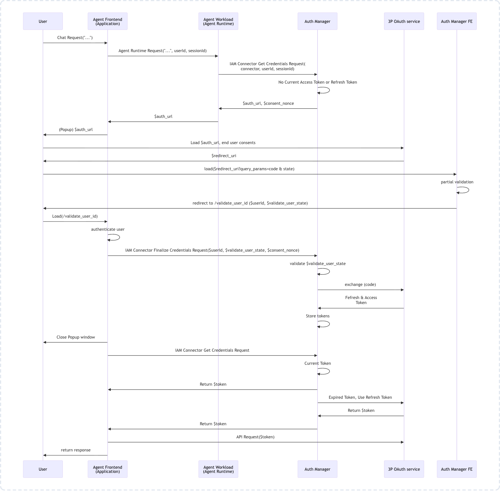
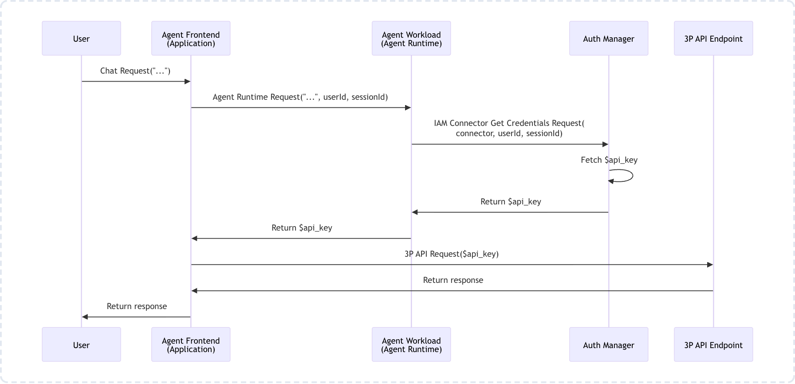

# Gemini Enterprise Agent Runtime - ADK Agent with 3LO

This repository contains an example for building and deploying an ADK (Agent Development Kit) agent to the Gemini Enterprise Agent Runtime (formerly Agent Engine). It demonstrates how to use modern security features, including **Agent Identity** and **3-Legged OAuth (3LO)** via [Agent Identity Auth Providers](https://docs.cloud.google.com/iam/docs/manage-auth-providers)

## Google Disclaimer
This is not an officially supported Google product

## Prerequisites

Before deploying and running this agent, you must complete some infrastructure setup steps in Google Cloud.

The following environment variables are referenced throughout these instructions and in multiple sections. Copy `.env_example` to `.env` and update accordingly.
```bash
GOOGLE_CLOUD_PROJECT= #GCP project ID
GOOGLE_CLOUD_LOCATION= #GCP location e.g. us-central1
STAGING_BUCKET= #GCS bucket for staging agent artifacts
AGENT_RUNTIME_DISPLAY_NAME= #Agent Runtime Display Name
CONTINUE_URI= #OAuth application, e.g. http://localhost:8080
MAIL_AUTH_RESOURCE_NAME= #Will be available after Auth Provider creation step below
WEATHER_API_AUTH_RESOURCE_NAME= #Will be available after Auth Provider creation step below
```
Ensure the following APIs are enabled in your Google Cloud project:
- Vertex AI API (aiplatform.googleapis.com)
- IAM API (iam.googleapis.com)
- Gmail API (gmail.googleapis.com)

```bash
gcloud services enable aiplatform.googleapis.com \
iam.googleapis.com gmail.googleapis.com \
--project=$GOOGLE_CLOUD_PROJECT
```

## Setup

### 1. Set up 3-Legged OAuth (3LO) Client
We'll use Gmail access for this demo to allow the agent to access a user's emails. To do this, you need a Google OAuth 2.0 client.
1. Go to the **APIs & Services > Credentials** page in the Google Cloud Console.
2. Click **Create Credentials > OAuth client ID**.
3. Select **Web application** as the application type.
4. Add your authorized redirect URIs. Agent Identity Auth Provider will generate the required redirect URI for you after the 3LO creation below. Current guidance can be found in the [Gemini Enterprise Agent Deployment Walkthrough](https://docs.cloud.google.com/gemini/enterprise/internal/agent-deployment-walkthrough).
5. Save the **Client ID** and **Client Secret**. You will need these to configure the Auth Provider.

### 2. Auth Provider 1: Create a 3LO Auth Provider in IAM
You need to create an Auth Provider (connector) that references your OAuth client. 
1. Follow the guidance at [Agent Identity Auth Models](https://docs.cloud.google.com/iam/docs/agent-identity-overview#auth-models). For this deployment, we'll use the [3-legged OAuth (3LO) with Auth Manager](https://docs.cloud.google.com/iam/docs/auth-with-3lo) option. This allows the agent to act on behalf of a user based on their explicit consent.
2. We will use the [Google Cloud CLI](https://docs.cloud.google.com/iam/docs/auth-with-3lo#gcloud) instructions to create the Auth Provider. Specific command paramaters are [here](https://docs.cloud.google.com/sdk/gcloud/reference/alpha/agent-identity/connectors/create).
3. Note the full resource name of the created provider. It will look like: `projects/[GOOGLE_CLOUD_PROJECT]/locations/[GOOGLE_CLOUD_LOCATION]/connectors/AUTH_PROVIDER_NAME`.
4. Note the generated OAuth Redirect URI to add to your OAuth client in the Google Cloud Console where you created your oauth Client ID.

```bash
export MAIL_AUTH_NAME=adk-agentruntime-gmail #Set your own value as needed

gcloud alpha agent-identity connectors create $MAIL_AUTH_NAME  \
    --location=$GOOGLE_CLOUD_LOCATION \
    --three-legged-oauth-authorization-url="https://accounts.google.com/o/oauth2/v2/auth?access_type=offline&prompt=consent" \
    --three-legged-oauth-token-url="https://oauth2.googleapis.com/token" \
    --three-legged-oauth-client-id=$OAUTH_CLIENT_ID \
    --three-legged-oauth-client-secret=$OAUTH_SECRET_ID    

# Update MAIL_AUTH_RESOURCE_NAME in `.env` with the following full resource name
gcloud alpha agent-identity connectors describe $MAIL_AUTH_NAME \
    --location=$GOOGLE_CLOUD_LOCATION --format="value(name)"

# Retrieve the generated OAuth Redirect URI to add to your OAuth client in the Google Cloud Console where you created your oauth Client ID
gcloud alpha agent-identity connectors describe $MAIL_AUTH_NAME \
    --location=$GOOGLE_CLOUD_LOCATION --format="value(connectorTypeParams.threeLeggedOauth.redirectUrl)"
```
#### OAuth 3LO Flow Diagram in Action


#### Handling OAuth Credential Exchange (if building a custom client)
To support the interactive OAuth flow, your [client application must](https://docs.cloud.google.com/iam/docs/auth-with-3lo#auth-trigger):
- Detect auth events: Look for events containing function calls with name == "adk_request_credential".
- Receive user_id_validation_state and auth_provider_name as query parameters.
- Retrieve the user_id and consent_nonce from the session context.
- Call the auth provider's FinalizeCredentials API with these parameters.
- Close the authorization window upon receiving a success response.
- NOTE: An example [client](./sample_client/) is included in this repository 

### 3. Auth Provider 2: Create an API Key Auth Provider in IAM
You need to create an Auth Provider (connector) that references your API Key to get the current weather. 
1. For this demo, I signed up for an API Key with https://weather.visualcrossing.com.  
2. Note the full resource name of the created provider. It will look like: `projects/[GOOGLE_CLOUD_PROJECT]/locations/[GOOGLE_CLOUD_LOCATION]/connectors/AUTH_PROVIDER_NAME`.

```bash
export WEATHER_API_AUTH_NAME=adk-agentruntime-weather #Set your own value as needed

gcloud alpha agent-identity connectors create $WEATHER_API_AUTH_NAME  \
    --location=$GOOGLE_CLOUD_LOCATION \
     --api-key="API_KEY" 

# Update WEATHER_API_AUTH_RESOURCE_NAME in `.env` with the following value
gcloud alpha agent-identity connectors describe $WEATHER_API_AUTH_NAME \
    --location=$GOOGLE_CLOUD_LOCATION --format="value(name)"
```


### 4. Agent Configuration and Deployment
Ensure all .env variables are set.

To deploy the agent to Gemini Enterprise Agent Runtime, see the following guide [Agent Identity for Agent Runtime](https://docs.cloud.google.com/gemini-enterprise-agent-platform/scale/runtime/agent-identity). The following script will run the deployment. If the Agent Runtime exists, the following `deploy.py` will *update* the deployment. If it doesn't exist, it will *create* a new deployment and output the Agent Identity that you'll use to set the `roles/iamconnectors.user` role.

```bash
python -m venv venvs
source venvs/bin/activate
pip install -r requirements.txt
python deploy.py
```

After the first deployment, you'll have an Agent Identity and can complete the following. The deployed agent is given access to all of the Auth Providers in the project created in the previous steps. As a best practice, you could also grant [specific connector-level access](https://docs.cloud.google.com/iam/docs/auth-with-3lo#connector-level-curl) via curl.

```bash
gcloud projects add-iam-policy-binding $GOOGLE_CLOUD_PROJECT \
    --role='roles/iamconnectors.user' \
    --member="principal://agents.global.org-[ORGANIZATION_ID].system.id.goog/resources/aiplatform/projects/[GOOGLE_CLOUD_PROJECT_NUMBER]/locations/$GOOGLE_CLOUD_LOCATION/reasoningEngines/ENGINE_ID"
```

## Validate Locally (Using a Sample Client and ADK Web)

### Start ADK Web

Set the following environment variable and run the ADK UI.
```
export GOOGLE_GENAI_USE_VERTEXAI=True
source venvs/bin/activate
adk web
```

### Start Sample Client
Run the following to start the sample client. Set the AGENT_BACKEND_URL variable in `sample_client/.env` to the ADK Web host:port above. Defaults to `http://localhost:8000`
```
cd sample_client/
python -m venv venvs
source venvs/bin/activate
pip install -r requirements.txt
uvicorn main:app --port 8080 --reload
```

### Chat
Navigate to `http://localhost:8080` and ask the agent to "list my emails" or "what is the weather in Chicago, IL?" If email access is needed, it will prompt you to authorize the agent to access your emails. Follow the prompts to complete the authorization.


## Debugging Auth Manager Credentials (3LO Flow)
If you have the following, you can debug an existing Auth Manager connector:
- An existing 3LO instance; For example, the one created in step #2 above
- A locally authenticated user with the the `roles/iamconnectors.user` role assigned against the connector or project


```bash
#Set Variables (also in .env)
MAIL_AUTH_RESOURCE_NAME=
USER_ID=

#Attempt to get credentials. If not found, AuthorizationURI and Nonce will be returned
read -r authorizationUri consentNonce <<< $(curl -s -X POST \
  -H "Authorization: Bearer $(gcloud auth print-access-token)" \
  -H "Content-Type: application/json" \
  -d '{
    "user_id": "'"$USER_ID"'",
    "continue_uri": "http://localhost:8080/commit",
    "scopes": ["https://mail.google.com/"]
  }' \
  "https://iamconnectorcredentials.googleapis.com/v1alpha/$MAIL_AUTH_RESOURCE_NAME/credentials:retrieve" |  jq -r ' .metadata.uriConsentRequired.authorizationUri, .metadata.uriConsentRequired.consentNonce')

echo "AuthorizationURI: ${authorizationUri}"
echo "Nonce: ${consentNonce}"

#Start listener.py to capture user_validation_state `python listener.py`
#Navigate to the AuthorizationURI above and perform OAuth consent
#Set USER_ID_VALIDATION_STATE below to the value received by listen.py
USER_ID_VALIDATION_STATE=""

#Finalize the Auth Manager credential flow (should return empty response, e.g. {})
curl -X POST \
  -H "Authorization: Bearer $(gcloud auth print-access-token)" \
  -H "Content-Type: application/json" \
  -d '{
    "userId": "'"$USER_ID"'",
    "userIdValidationState": "'"$USER_ID_VALIDATION_STATE"'",
    "consentNonce": "'"$consentNonce"'"
  }' \
  "https://iamconnectorcredentials.googleapis.com/v1alpha/$MAIL_AUTH_RESOURCE_NAME/credentials:finalize"

#Call the same credentials:retrieve endpoint from earlier, the bearer access token will now be included
ACCESS_TOKEN=$(curl -s -X POST \
  -H "Authorization: Bearer $(gcloud auth print-access-token)" \
  -H "Content-Type: application/json" \
  -d '{
    "user_id": "'"$USER_ID"'",
    "continue_uri": "http://localhost:8080/commit",
  }' \
  "https://iamconnectorcredentials.googleapis.com/v1alpha/$MAIL_AUTH_RESOURCE_NAME/credentials:retrieve" | jq -r .response.token)
echo "ACCESS_TOKEN: ${ACCESS_TOKEN:0:15}..."

#Validate access token. Get latest message id with the Auth Manager access token
read -r messageId <<< $(curl -s \
  -H "Authorization: Bearer $ACCESS_TOKEN" \
  -H "Content-Type: application/json" \
"https://gmail.googleapis.com/gmail/v1/users/me/messages?maxResults=1" | jq -r '.messages[0].id')

#Get the full email message with the Auth Manager access token
curl -s \
  -H "Authorization: Bearer $ACCESS_TOKEN" \
  -H "Content-Type: application/json" \
https://gmail.googleapis.com/gmail/v1/users/me/messages/$messageId | jq -r .snippet
```

## Debugging API Key Credentials
If you have the following, you can debug an existing Auth Manager connector:
- An existing API Key instance; For example, the one created in step #3 above
- A locally authenticated user with the the `roles/iamconnectors.user` role assigned against the connector or project


```bash
#Set Variables (also in .env)
WEATHER_API_AUTH_RESOURCE_NAME=
USER_ID=

#Retrieve Credentials
API_KEY=$(curl -s -X POST \
  -H "Authorization: Bearer $(gcloud auth print-access-token)" \
  -H "Content-Type: application/json" \
  -d '{
    "user_id": "'"$USER_ID"'",
  }' \
  "https://iamconnectorcredentials.googleapis.com/v1alpha/$WEATHER_API_AUTH_RESOURCE_NAME/credentials:retrieve" | jq -r .response.token)

#Retrieve weather data for Reston,VA
curl -s "https://weather.visualcrossing.com/VisualCrossingWebServices/rest/services/timeline/Reston,VA?key=$API_KEY&include=current&elements=remove:stations"
```